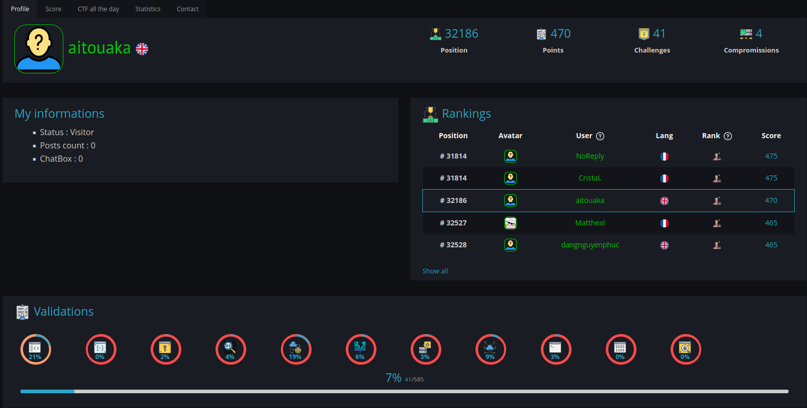

# 💫 About Me:
I am currently in the final year of a double diploma program in Computer Science Engineering and second year a Master's student (M2) in Cybersecurity. My interests lie in cybersecurity, embedded systems, software and hardware security, and I am excited to explore new challenges in these areas.

## 🌐 Socials:

&nbsp;

### Hack the  Box profile:
---

### Root me profile:
---

# 💻 Tech Stack:

 

 
 

 

 
 
 

 

---

---
<!--
# 📊 GitHub Stats:

---

 
 
## 🏆 GitHub Trophies

< ### ✍️ Random Dev Quote

### 🔝 Top Contributed Repo

--> 